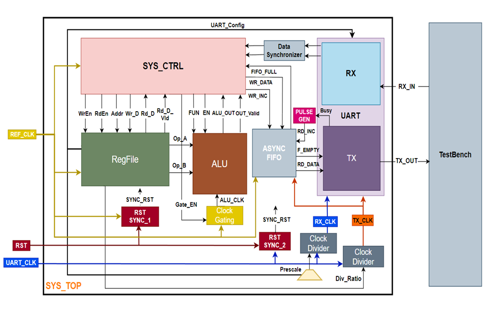

# Low-Power-Configurable-Multi-Clock-Digital-System

A UART-controlled system with ALU operations and register file management.

## Features
- Dual clock domain architecture
- 14 ALU operations
- UART communication interface
- Register file with 16 addressable locations
- Clock gating and synchronization

## Block Diagram

## Clock Domains
1. **REF_CLK (50MHz) Domain**
   - Register File
   - ALU
   - System Controller
   - Clock Gating

2. **UART_CLK (3.6864MHz) Domain**
   - UART TX/RX
   - Clock Divider
   - Pulse Generator

[Detailed Clock Domain Documentation](docs/Clock_Domains.md)
