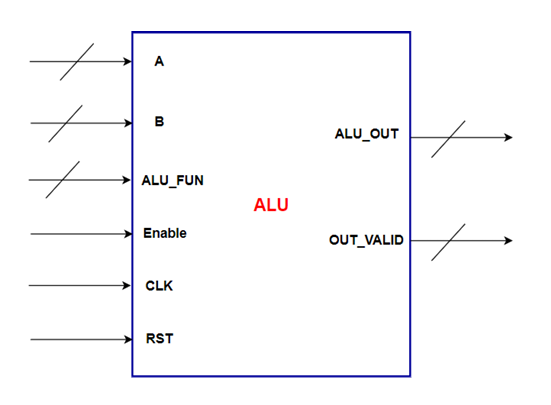

# ALU Operations

## Description
Performs arithmetic and logic operations on operands from the RegFile.

## Block Diagram

## Interface and Signal Description

| Port | Direction | Width | Description |
|---|---|---|---|
| CLK | IN | 1 | Clock Signal (Gated Clock) |
| RST | IN | 1 | Active Low Reset |
| A | IN | Parameterized   (default: 8 bits) | Operand A from RegFile (REG0) |
| B | IN | Parameterized   (default: 8 bits) | Operand B from RegFile (REG1) |
| ALU_FUN | IN | Parameterized   (default: 4 bits) | ALU Function Code |
| Enable | IN | 1 | ALU Enable |
| ALU_OUT | OUT | Parameterized   (default: 8 bits) | ALU Result |
| OUT_VALID | OUT | 1 | Result Valid Flag |

## Supported Functions
| Code | Operation | Description          |
|------|-----------|----------------------|
| 0x0  | ADD       | Addition             |
| 0x1  | SUB       | Subtraction          |
| 0x2  | MUL       | Multiplication       |
| ...  | ...       | ...                  |
