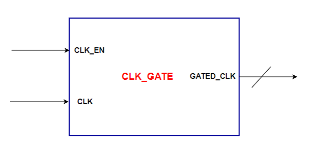

# Clock Gating

## Description
Provides gated clock signal to the ALU, based on enable signal.

## Block Diagram

## Interface and Signal Description

| Port | Direction | Width | Description |
|---|---|---|---|
| CLK | IN | 1 | Reference Clock |
| CLK_EN | IN | 1 | Clock Enable Signal |
| GATED_CLK | OUT | 1 | Gated Clock Output |
