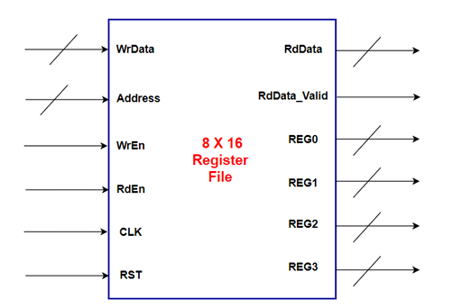

# Register File

## Description
Register file stores operands and data for the ALU and UART.

## Block Diagram

## Interface and Signal Description

| Port | Direction | Width | Description |
|---|---|---|---|
| CLK | IN | 1 | Clock Signal (REF_CLK) |
| RST | IN | 1 | Active Low Reset |
| Address | IN | Parameterized   (default: 4 bits) | Address Bus |
| WrEn | IN | 1 | Write Enable |
| RdEn | IN | 1 | Read Enable |
| WrData | IN | Parameterized   (default: 8 bits) | Write Data Bus |
| RdData | OUT | Parameterized   (default: 8 bits) | Read Data Bus |
| RdData_Valid | OUT | 1 | Read Data Valid |
| REG0 | OUT | Parameterized   (default: 8 bits) | Register at Address 0x0   (ALU: Operand A) |
| REG1 | OUT | Parameterized   (default: 8 bits) | Register at Address 0x1   (ALU: Operand B) |
| REG2 | OUT | Parameterized   (default: 8 bits) | Register at Address 0x2   (UART: Config) |
| REG3 | OUT | Parameterized   (default: 8 bits) | Register at Address 0x3   (Clock Divider: Div Ratio) |

## Register Map

| Address | Name    | Description                     | Default |
|---------|---------|---------------------------------|---------|
| 0x0     | REG0    | ALU Operand A                   | -       |
| 0x1     | REG1    | ALU Operand B                   | -       |
| 0x2     | REG2    | UART Configuration              | 0x81    |
| 0x3     | REG3    | Clock Divider Ratio             | 0x20    |
| 0x4-0x15| RF      | General Purpose Registers       | -       |

**UART Configuration (REG2)**
 - REG2[0]   : Parity Enable (1=Enabled)
 - REG2[1]   : Parity Type (0=Even, 1=Odd)
 - REG2[7:2] : Prescale Value
