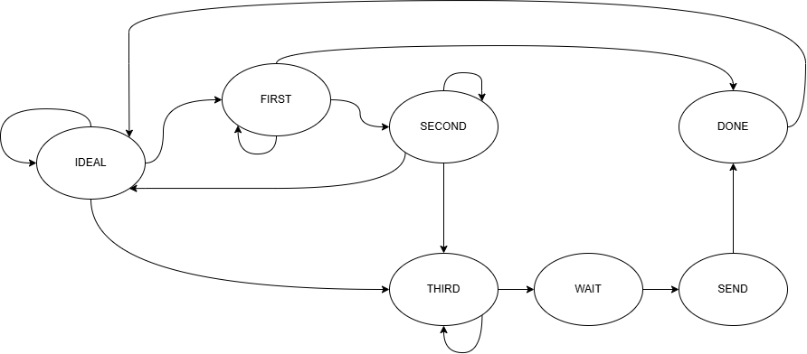
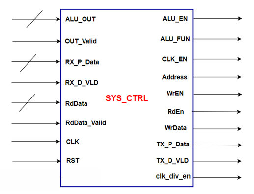

# System Controller

## Description
Main controller that manages system operations and data flow.

The system controller includes a finite state machine (FSM) to decode commands received through UART_RX. The states are as follows:

1) **IDEAL**: Wait for a valid signal from UART_RX.
2) **FIRST**: Wait for the first frame from the data synchronizer, which could be the address (for a Read Command), the write address (for a Write Command), data (for an ALU Command with the first operand), or the ALU function (for an ALU Command without operands) from UART_RX.
3) **SECOND**: Wait for the second frame, which could either be the data (for an ALU Command with the second operand) or the write data (for a Write Command) from UART_RX.
4) **THIRD**: Wait for the third frame, which contains the ALU function (for an ALU Command with or without operands) from UART_RX.
5) **WAIT**: Wait for the ALU to complete its operation (for an ALU Command with or without operands).
6) **SEND**: Send the least significant byte of the ALU result first, followed by the most significant byte in the **DONE** state.
7) **DONE**: Send the final data to the output.

## Block Diagram

## Interface and Signal Description

| Port | Direction | Width | Description |
|---|---|---|---|
| CLK | IN | 1 | Reference Clock |
| RST | IN | 1 | Active Low Reset |
| ALU_OUT | IN | 16 | ALU Result |
| OUT_Valid | IN | 1 | ALU Result Valid |
| ALU_FUN | OUT | 4 | ALU Function Code |
| EN | OUT | 1 | ALU Enable |
| CLK_EN | OUT | 1 | Clock Gate Enable |
| Address | OUT | 4 | Register File Address |
| WrEn | OUT | 1 | Register File Write Enable |
| RdEn | OUT | 1 | Register File Read Enable |
| WrData | OUT | 8 | Register File Write Data |
| RdData | IN | 8 | Register File Read Data |
| RdData_Valid | IN | 1 | Register File Data Valid |
| RX_P_DATA | IN | 8 | Received Data from UART_RX |
| RX_D_VLD | IN | 1 | RX Data Valid |
| TX_P_DATA | OUT | 8 | Data to UART_TX |
| TX_D_VLD | OUT | 1 | TX Data Valid |
| clk_div_en | OUT | 1 | Clock Divider Enable |
