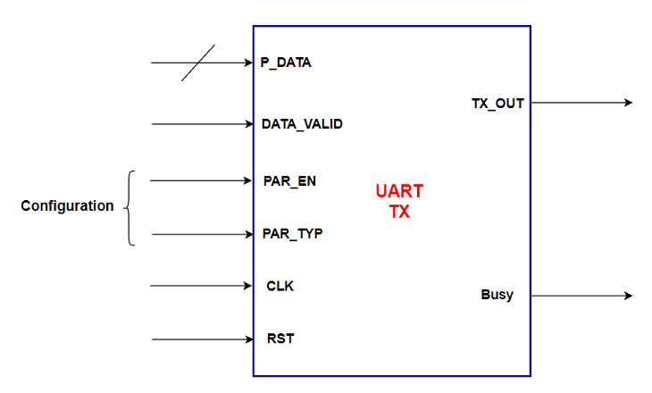
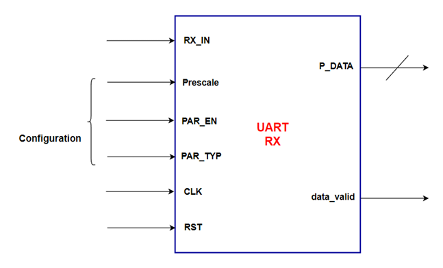

# UART Documentation

## Description
Handles serial data transmission (UART_TX) and reception (UART_RX).

## Block Diagram

### 1. UART_TX

### 2. UART_RX

## Interface and Signal Description

### 1. UART_TX
| Port | Direction | Width | Description |
|---|---|---|---|
| CLK | IN | 1 | Clock Signal |
| RST | IN | 1 | Active Low Reset |
| PAR_EN | IN | 1 | Parity Enable |
| PAR_TYP | IN | 1 | Parity Type |
| P_DATA | IN | Parameterized   (default: 8 bits) | Parallel Input Data |
| DATA_VALID | IN | 1 | Input Data Valid |
| S_DATA | OUT | 1 | Serial Output Data |
| Busy | OUT | 1 | UART Busy Status |

### 2. UART_RX
| Port | Direction | Width | Description |
|---|---|---|---|
| CLK | IN | 1 | Clock Signal |
| RST | IN | 1 | Active Low Reset |
| Prescale | IN | 6 | Prescale Value |
| PAR_EN | IN | 1 | Parity Enable |
| PAR_TYP | IN | 1 | Parity Type |
| RX_IN | IN | 1 | Serial Input Data |
| P_DATA | OUT | Parameterized   (default: 8 bits) | Parallel Output Data |
| DATA_VLD | OUT | 1 | Output Data Valid |
| PAR_ERR | OUT | 1 | Parity Error |
| STP_ERR | OUT | 1 | Stop Bit Error |
